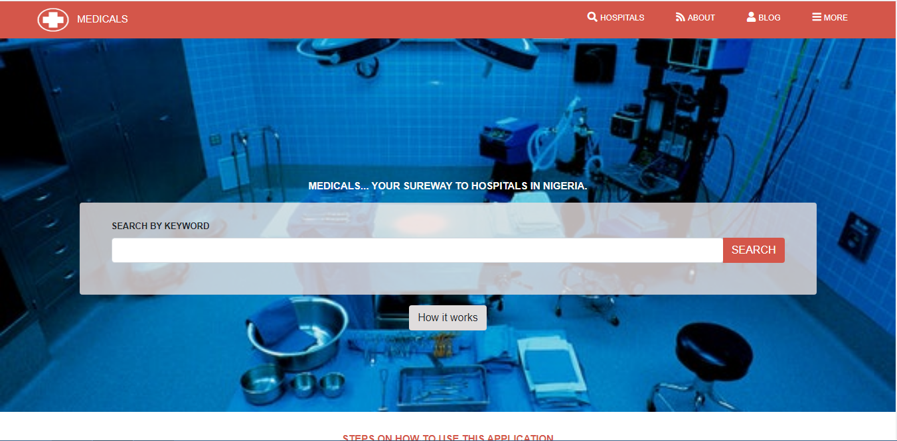

# Hospital-directory-in-Nigeria

This project is a sample of an online directory of the hospitals in Nigeria. This project based on the prototype made by Mathew Njuguna and others on Behance.

This project is my HTML & CSS Capstone Project in the Microverse program.

This project aimed to apply all the basics HTML & CSS properties I have learned using best practices to conclude my HTML & CSS section of the Microverse software development Program.



## Built With

- HTML & CSS
- FontAwesome
- Bootstrap 4

## Live Demo

[Live Demo Link](https://rawcdn.githack.com/Godswilly/hospital-directory-in-nigeria/efd3a008d2cca7f0f79887766f55111f3bcad50e/index.html)

## Demo Video

[Application Demo Video](https://www.loom.com/share/81463e5b614d4b4f96c4452d5eaa09bb)

## Getting Started

To get a local copy of the repository, please run the following commands on your terminal:

```
$ cd <folder>
```

```
$ git clone https://github.com/Godswilly/hospital-directory-in-nigeria/tree/master

```

## AUTHOR
👤 **Kalu Agu Kalu***

- [Github]( https://github.com/Godswilly)
- [Twitter](https://twitter.com/KaluAguKalu17)
- [Linkedin](https://www.linkedin.com/in/kalu-agu-kalu/)

## 🤝 Contributing

Contributions, issues, and feature requests are welcome!

Feel free to check the [issues page](https://github.com/Godswilly/hospital-directory-in-nigeria/issues).

## Show your support

Give and ⭐️ if you like this project!

## Acknowledgments

- UI Design Credits goes to [ Mathew Njuguna and others on Behance](https://www.behance.net/gallery/25563385/PatashuleKE)
- This project is my Microverse HTML/CSS capstone project
